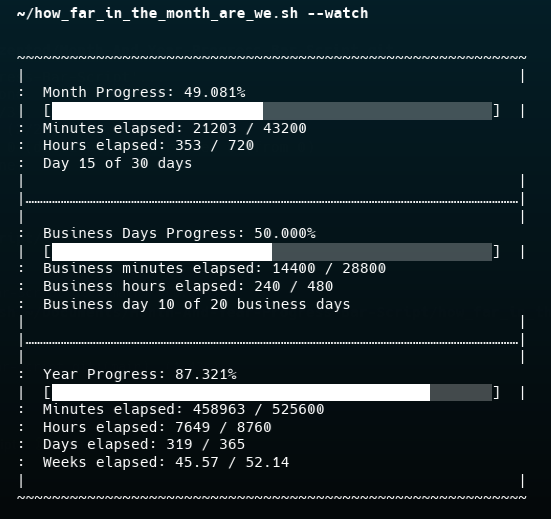

# Month & Year Progress Bar Script

> A small Bash script that prints progress bars and stats showing how far through the current month, the business days of the month, and the current year you are.

This repository contains a single script: `how_far_in_the_month_are_we.sh` (MIT-licensed). The script is intended for interactive use in a terminal and can also run in watch mode to refresh periodically.

## What it does

- Shows a percentage and a 50-character progress bar for the full month.
- Shows the same for business days (Mon–Fri) in the current month.
- Shows a percentage and bar for the current year, with minutes/hours/days/weeks elapsed.
- Outputs numeric counts for minutes/hours/days/weeks elapsed vs totals.

## Requirements

- Bash (POSIX-ish shell is fine, the script uses bash features).
- GNU coreutils `date` (the script uses `date -d` for flexible date arithmetic). On macOS, the BSD `date` does not support `-d`; use GNU date via Homebrew (`brew install coreutils`) or run under WSL/Git-Bash where GNU `date` is available.
- `awk` (standard on most Unix-like systems).

Note: The script has been tested under environments that provide GNU `date` (Linux, WSL). If you use Git Bash on Windows or WSL, the script should run as-is.

## Files

- `how_far_in_the_month_are_we.sh` — main script (executable shell script).
- `LICENSE` — MIT license.

## Quick start

Make the script executable and run it:

```bash
chmod +x how_far_in_the_month_are_we.sh
./how_far_in_the_month_are_we.sh
```

Run it in watch/refresh mode (updates every minute by default):

```bash
./how_far_in_the_month_are_we.sh --watch
```

You can change the refresh interval by editing the `WATCH_INTERVAL` variable at the top of the script (default 60 seconds).

## Sample output



## Script behavior and output

- The script computes minutes elapsed and total minutes for the month and expresses progress as a percentage with 3 decimal places.
- It builds three 50-character bars (month, business days, year) using filled and empty block characters.
- Business days are counted as Monday (1) through Friday (5). The business-day progress uses the same minutes-based approach restricted to business days.

### Contract (inputs / outputs)

- Inputs: current system date/time; optional `--watch` flag.
- Outputs: formatted text printed to stdout — 3 progress sections (month, business days, year) with bars and numeric statistics.
- Error modes: If `date -d` is unavailable or fails, the script may error with `date: invalid date` or similar.

## Compatibility & Troubleshooting

- If you see errors like `date: invalid date` on macOS, install GNU coreutils and use its `gdate` (or run under WSL):

  ```bash
  # example using gdate after installing coreutils via Homebrew
  gdate -d "2025-11-01 + 1 month - 1 day" +%d
  ```

- To run the script with `gdate`, replace calls to `date` in the script with `gdate` (or create a small wrapper or alias). Running under WSL/Linux is the easiest option.

- If the bar characters look wrong in your terminal, ensure it supports UTF-8 and block characters; use a modern terminal emulator.

## Customization

- `WATCH_INTERVAL` near the top controls how often the watch mode refreshes (seconds).
- `bar_length` in the script controls the width of each progress bar (50 by default).

## License

This project is licensed under the MIT License. See `LICENSE` for details.

## Contributing

Small fixes and documentation improvements are welcome. Open a PR or file an issue.

---

© 2025 Michael Perez